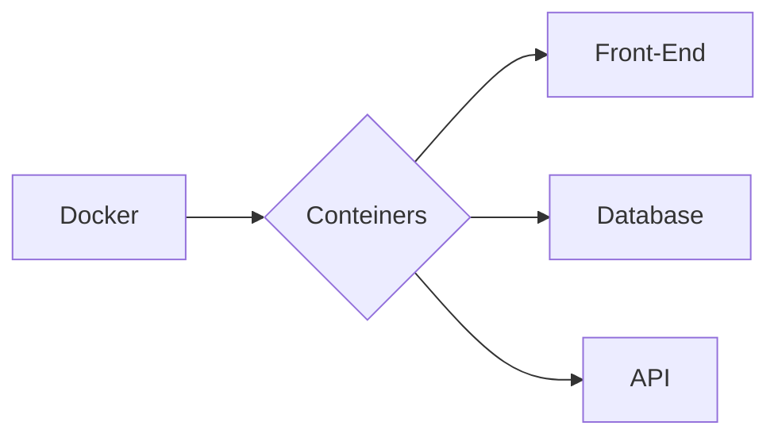

# Sobre o Projeto:
Estudos utilizando o Docker

- Dockerfile
- Docker Compose


### INSTALAÇÃO

```
1º - Instalar Docker (url: https://www.docker.com/get-started)
2º - Instalar WSL2 (url: https://www.windowscentral.com/how-install-wsl2-windows-10)
3º - Habilitar Hyper V (url: https://docs.microsoft.com/pt-br/virtualization/hyper-v-on-windows/quick-start/enable-hyper-v)
```


### COMANDOS DOCKER FILE

```
1º - Finalizar: docker stop {name_container}
2º - 
3º -
```

### COMANDOS DOCKER COMPOSE

```
1º - Iniciar docker: docker-compose up
2º - Url: http://app.localhost/
3º -
```
```


### FLUXOGRAMA/DIAGRAMA



### FONTE:
Docker em 22 minutos: (url: https://www.youtube.com/watch?v=Kzcz-EVKBEQ)

### 1.0 - CICLO DE VIDA

<ul>
  
  <li>
    <p><b><code>1.1 - [] </code></b></p>
    <p><i> Instrução:  </i></p>
  </li>
  
  <li>
    <p><b><code>1.2 - [] </code></b></p>
    <p><i> Fase-1:  </i></p>
  </li> 
  
  <li>
    <p><b><code>1.3 - [] </code></b></p>
    <p><i>  </i></p>
  </li>
  
</ul>

