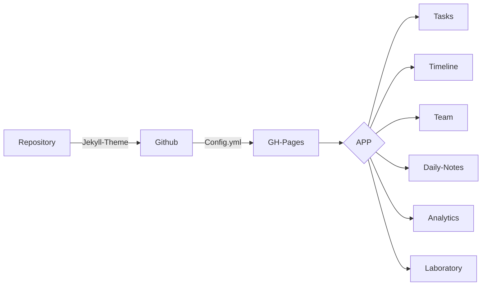

# Sobre o Projeto:
Desenvolvimento de um projeto que analisa editais e questões de concursos


### COMANDOS

```
1º - Instalar Docker (url: https://www.docker.com/get-started)
2º - Instalar WSL2 (url: https://www.windowscentral.com/how-install-wsl2-windows-10)
3º - Habilitar Hyper V (url: https://docs.microsoft.com/pt-br/virtualization/hyper-v-on-windows/quick-start/enable-hyper-v)
4º - Publicar pagina 
```


### FLUXOGRAMA/DIAGRAMA



### FONTE:


### 1.0 - FASES DO PROJETO

<ul>
  
  <li>
    <p><b><code>1.1 - [VIRTUAL ENV] </code></b></p>
    <p><i> Instrução:  </i></p>
  </li>
  
  <li>
    <p><b><code>1.2 - [FRONT-END] </code></b></p>
    <p><i> Fase-1: https://www.youtube.com/watch?v=wCOInE7-E0I  </i></p>
  </li> 
  
  <li>
    <p><b><code>1.3 - [BACK-END] </code></b></p>
    <p><i>  </i></p>
  </li>
  
</ul>

